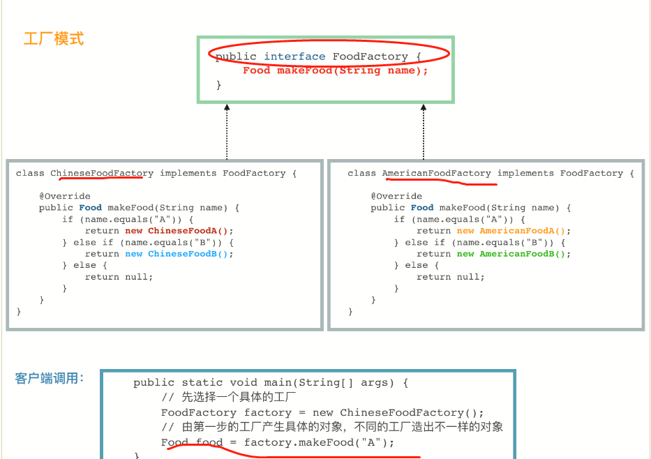
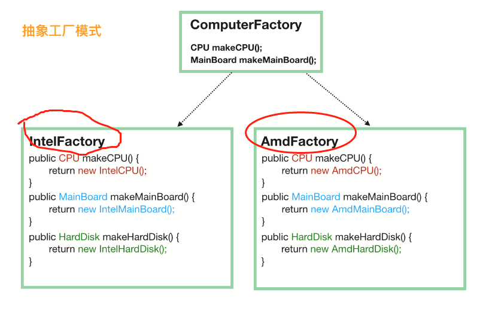

**《设计模式》**

设计模式总共分为23类，按照大类划分三大类：1.创建型模式，2.结构型模式、3.行为型模式。

# 一、创建型模式 #

创建型模式其实质就是创建更加友好的对象的方式。

## 1.简单工厂模式 ##

    public class FoodFactory {

    public static Food makeFood(String name) {
        if (name.equals("noodle")) {
            Food noodle = new LanZhouNoodle();
            noodle.addSpicy("more");
            return noodle;
        } else if (name.equals("chicken")) {
            Food chicken = new HuangMenChicken();
            chicken.addCondiment("potato");
            return chicken;
        } else {
            return null;
        }
    }
    }

上述代码中，LanZhouNoodle和HuangMenChicken都继承自Food。简单工厂模式的关键点在于，1.一个工厂类中有一个静态方法；2.静态方法可以传入参数，根据参数返回派生自同一个父类(或实现统一接口)的实例对象；3.强调职责单一原则，一个类只提供一种功能，上述FoodFactory的功能只负责生产各种事物。

## 2.工厂模式 ##

在实际中，我们往往需要两个以上的工厂，所以需要通过实现相同工厂的接口去实现不同工厂，而不同工厂中生成对象的方式和简单工厂相似。

  
 

## 3.抽象工厂模式 ##

抽象工厂是指多个工厂通过继承或者实现同一个接口或者类，在实例化时，指定同一个工厂去生成各个组件，用同一个工厂生产的组件生成抽象对象，当该对象还需要其他组件时，需要在实例工厂类中添加相应的方法。下面通过生产一台电脑的例子进行描述

  
 

    public static void main(String[] args) {
    // 第一步就要选定一个“大厂”
    ComputerFactory cf = new AmdFactory();
    // 从这个大厂造 CPU
    CPU cpu = cf.makeCPU();
    // 从这个大厂造主板
    MainBoard board = cf.makeMainBoard();
      // 从这个大厂造硬盘
      HardDisk hardDisk = cf.makeHardDisk();

    // 将同一个厂子出来的 CPU、主板、硬盘组装在一起
    Computer result = new Computer(cpu, board, hardDisk);
    }

## 单例模式 ##

**(1)饿汉式模式**

    public class Singleton {
    // 首先，将 new Singleton() 堵死
    private Singleton() {};
    // 创建私有静态实例，意味着这个类第一次使用的时候就会进行创建
    private static Singleton instance = new Singleton();

    public static Singleton getInstance() {
        return instance;
    }
    // 瞎写一个静态方法。这里想说的是，如果我们只是要调用 Singleton.getDate(...)，
    // 本来是不想要生成 Singleton 实例的，不过没办法，已经生成了
    public static Date getDate(String mode) {return new Date();}
    }
**(2)饱汉式模式**

    public class Singleton {
    // 首先，也是先堵死 new Singleton() 这条路
    private Singleton() {}
    // 和饿汉模式相比，这边不需要先实例化出来，注意这里的 volatile(禁止指令重排序)，它是必须的
    private static volatile Singleton instance = null;

    public static Singleton getInstance() {
        if (instance == null) {
            // 加锁
            synchronized (Singleton.class) {
                // 这一次判断也是必须的，不然会有并发问题
                if (instance == null) {
                    instance = new Singleton();
                }
            }
        }
        return instance;
    }
    }

1.饿汉式单例模式需要创建**静态私有**实例，而饱汉式是需要声明一个静态私有实例对象，且需要使用**volatile**修饰该对象。

2.饿汉式直接通过getInstance方法返回一个对象，但是饱汉式需要加锁并进行双重检查。先判断实例是否为空，然后对类对象加锁，在判断实例对象是否为空，如果双重检查都为空则生成实例对象。sychronized.

(3)嵌套类

    public class Singleton3 {

    private Singleton3() {}
    // 主要是使用了 嵌套类可以访问外部类的静态属性和静态方法 的特性
    private static class Holder {
        private static Singleton3 instance = new Singleton3();
    }
    public static Singleton3 getInstance() {
        return Holder.instance;
    }
    }

在类中嵌套一个静态类用于实例化该类，返回静态类的实例。

## 4.建造者模式 ##

经常碰见的 XxxBuilder 的类，通常都是建造者模式的产物。建造者模式其实有很多的变种，但是对于客户端来说，我们的使用通常都是一个模式的：

    Food food = new FoodBuilder().a().b().c().build();
    Food food = Food.builder().a().b().c().build();

套路就是先 new 一个 Builder，然后可以链式地调用一堆方法，最后再调用一次 build() 方法，我们需要的对象就有了。

    class User {
    // 下面是“一堆”的属性
    private String name;
    private String password;
    private String nickName;
    private int age;

    // 构造方法私有化，不然客户端就会直接调用构造方法了
    private User(String name, String password, String nickName, int age) {
        this.name = name;
        this.password = password;
        this.nickName = nickName;
        this.age = age;
    }
    // 静态方法，用于生成一个 Builder，这个不一定要有，不过写这个方法是一个很好的习惯，
    // 有些代码要求别人写 new User.UserBuilder().a()...build() 看上去就没那么好
    public static UserBuilder builder() {
        return new UserBuilder();
    }

    public static class UserBuilder {
        // 下面是和 User 一模一样的一堆属性
        private String  name;
        private String password;
        private String nickName;
        private int age;

        private UserBuilder() {
        }

        // 链式调用设置各个属性值，返回 this，即 UserBuilder
        public UserBuilder name(String name) {
            this.name = name;
            return this;
        }

        public UserBuilder password(String password) {
            this.password = password;
            return this;
        }

        public UserBuilder nickName(String nickName) {
            this.nickName = nickName;
            return this;
        }

        public UserBuilder age(int age) {
            this.age = age;
            return this;
        }

        // build() 方法负责将 UserBuilder 中设置好的属性“复制”到 User 中。
        // 当然，可以在 “复制” 之前做点检验
        public User build() {
            if (name == null || password == null) {
                throw new RuntimeException("用户名和密码必填");
            }
            if (age <= 0 || age >= 150) {
                throw new RuntimeException("年龄不合法");
            }
            // 还可以做赋予”默认值“的功能
              if (nickName == null) {
                nickName = name;
            }
            return new User(name, password, nickName, age);
        }
    }
    }

核心是：先把所有的属性都设置给 Builder，然后 build() 方法的时候，将这些属性复制给实际产生的对象。

看看客户端的调用：public class APP {
    public static void main(String[] args) {
        User d = User.builder()
                .name("foo")
                .password("pAss12345")
                .age(25)
                .build();
    }
    }

## 5 原型模式 ##

原型模式很简单：有一个原型实例，**基于这个原型实例产生新的实例，**也就是“克隆”了。Object 类中有一个 **clone()** 方法，它用于生成一个新的对象，当然，如果我们要调用这个方法，java 要求我们的类必须先实现 Cloneable 接口，此接口没有定义任何方法，但是不这么做的话，在 clone() 的时候，会抛出 CloneNotSupportedException 异常。

java 的克隆是**浅克隆**，碰到对象引用的时候，克隆出来的对象和原对象中的引用将指向同一个对象。通常实现深克隆的方法是**将对象进行序列化，然后再进行反序列化。**

创建型模式总结：简单工厂最简单，只能生成一个对象，工厂模式是在简单工厂之上定义一个工厂接口，多个工厂类通过实现这个接口拓展了工厂的维度，抽象工厂具备产品族的该类，除了统一的工厂接口外，还需要有生成组件对象的方法，如果想要得到所需的对象，需要通过实例化的对象生成各个组件，并拼装成所需对象。单例模式主要记住双重检测机制的模式以及嵌套静态类的方法。创建者模式主要针对属性较多的类实现链式编程，原型模式类似于克隆，Object中clone()即有原型模式的思想。