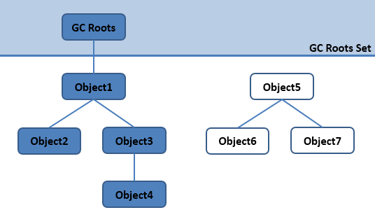
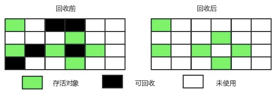
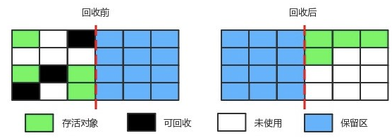

# 《深入理解JVM虚拟机》 #

**JVM体系总体上分为四大块**

- 类的加载机制《第六，七章》
- jvm内存结构《第二章》
- GC算法以及垃圾回收器《第三章》
- 虚拟机性能调优《第四、五章》

# 1.Java虚拟机运行时数据区域 #

## - 程序计数器 ##

记录当前线程所执行的字节码行号，用于获取下一条执行的字节码，Java虚拟机的多线程是通过轮流切换和分配处理器时间来实现的，为了线程切换后能够恢复到正确的位置，每个线程都需要有一个独立的程序计数器，所以程序计数器是**线程私有**的。

线程执行Java方法，这个计数器记录的是正在执行的虚拟机字节码，如果执行Native方法，这计数器为空。**程序计数器是唯一一个在Java虚拟机规范中没有规定任何OutOfMemoryError内存溢出错误的区域。**

## - Java虚拟机栈 ##

Java虚拟机栈也是线程私有，生命周期与线程相同，虚拟机栈描述的是Java方法执行的内存模型：每个方法在执行的时候都会同时创建一个栈帧用于存储局部变量表、操作栈、动态链接、方法出口等信息。每个方法被调用直至执行完成的过程，就对应于栈帧在虚拟机栈中从入栈到出栈的过程。

局部变量表存放在编译时可知的八种基本数据类(boolean,byte,short,int,char,long,float,double),对象引用和returnAddress类型。

long,double为64长度的数据占用2个局部变量空间，其余数据类型只占1个局部变量空间，局部变量内存空间在编译期间完成分配。

两种异常：当线程请求的栈深度大于虚拟机锁允许的深度，将抛出StackoverflowError异常，
当虚拟机动态扩展无法申请足够的内存时(大部分虚拟机可动态扩展，也允许固定长度的虚拟机栈)，将会抛出OutOfMemoryError异常。

## - 本地方法栈 ##

本地方法栈与虚拟机栈所发挥的作用非常相似去区别主要是虚拟机栈执行Java方法(字节码)，而本地方法则为虚拟机使用到的Native方法服务，本地方法会抛出StackOverflowError和OutOfMemoryError。

## -Java堆 ##
Java堆是Java虚拟机所管理的内存中最大的一块。Java堆是被所有**线程共享**的一块区域，在虚拟机启动时创建。此内存区域的唯一目的就是存放对象实例，几乎所有的对象实例都在这里分配内存。

Java对是垃圾收集器管理的主要区域，因此很多时候也被称为"GC堆"。由于现在收集器都采用分代收集算法，所以Java堆中还可以细分为：新生代和老年代；在细致一点的有Eden空间、FromSurvivor空间、ToSurvivor空间。

Java虚拟机规定，Java堆可以处于物理上不连续的内存空间，只要逻辑上是连续的即可，就像我们的磁盘空间一样。在现实中，既可以实现固定大小的，也可以是可扩展的，当前虚拟机是可扩展来实现的(通过**-Xmx和-Xms**控制)。如果在堆中没有内存完成实例分配，并且堆也无法再扩展时，将会抛出OutOfMemoryError异常。

## - 方法区 ##

方法区与Java堆一样，是各个线程共享的内存区域，它被用于已经被虚拟机加载的类信息、常量、静态变量、即时编译器编译后的代码等数据。虽然Java虚拟机规范把方法区描述为堆的一个逻辑部分，但是它却有一个别名叫做Non-Heap(非堆)，主要是为了与Java堆区分开。

对于习惯在HotSpot虚拟机上开发和部署程序的开发者来说，很多人愿意将方法区成为**永久代**是实际上两者并不等价，仅因为HotSpot虚拟机的设计团队选择将GC分代收集到方法区，或者使用永久代来实现方法区。

除和Java堆一样不需要连续的内存和可以选择固定大小或者可扩展外，还可以选择不实现垃圾回收。相对而言，垃圾回收行为在这个区域是比较少出现的，但并不是数据进入方法区就永久存在啦，这个区域的内存回收目标主要是针对常量池的回收和对类型的卸载。Java虚拟机规范规定，当方法区无法满足内存分配需求时，将抛出OutOfMemoryError异常。

## - 运行时常量池 ##

运行时常量池是方法区的一部分。Class文件中除了有类的版本、字段、方法、接口等描述信息，还有一项信息是常量池，用于存放编译器生成的各种字面量和符号引用。

运行时常量池相对于Class文件常量池的另一个重要特征是具备动态性，Java语言并不要求常量一定只有编译器才能产生，也就是并非预置入Class文件中常量池内容才能进入方法区的常量池。这种特性被开发人员利用的比较多的是String类的intern()方法。

## -直接内存 ##

- -Xms设置堆的最小空间大小。
- -Xmx设置堆的最大空间大小。
- -XX:NewSize设置新生代最小空间大小。
- -XX：MaxNewSize设置新生代最大空间大小。
- -XX：PermSize设置永久代最小空间大小。
- -XX：MaxPermSize设置永久代最大空间大小。
- -Xss设置每个线程的堆栈大小。

内容来源：`https://mp.weixin.qq.com/s?__biz=MzI4NDY5Mjc1Mg==&mid=2247483949&idx=1&sn=8b69d833bbc805e63d5b2fa7c73655f5&chksm=ebf6da52dc815344add64af6fb78fee439c8c27b539b3c0e87d8f6861c8422144d516ae0a837&scene=21#wechat_redirect`

《深入理解Java虚拟机》

# 2.Java类的加载机制 #

## 什么是类加载？ ##

类的加载指的是将类的.class文件中的二进制数据读到内存中，将其放在运行时数据区的**方法区**内，然后在**堆区**创建一个java.lang.class对象，用来封装类在方法区内的数据结构。类的加载的最终产品是位于**堆区的Class对象**，class对象封装了类在方法区内的数据结构，并且向Java程序员提供了访问方法区内的数据结构的接口。

类加载器并不需要等到某个类被“首次主动使用”时再加载它，JVM规范允许类加载器在预料某个类将要被使用时就**预先加载它**，如果在预先加载的过程中遇到了.class文件缺失或存在错误；类加载器必须在使用该类时才报告错误(LinkageError错误)如果这个类一直没有被程序主动使用，那么类加载器就不会报告错误。

## 类的生命周期 ##

类的生命周期包括：加载-->**验证**-->**准备**-->**解析**-->初始化-->使用-->卸载，其中验证-->准备-->解析3部分统称为连接。加载-->验证-->准备-->初始化-->卸载这5个阶段的顺序使确定的，类加载的过程必须按照这种顺序开始，但是解析过程则不一定：它在某些情况下可以在初始化阶段之后再**开始**，这是为了支持Java语言的运行时绑定(也称为动态绑定)，**注意：**只是按顺序开始，而不一定按顺序完成，主要是因为这些阶段通常是相互交叉地混合式进行的，通常会在一个阶段执行的过程中调用、激活另一个阶段。

Java虚拟机规范中，类加载的第一个阶段的开始具体由虚拟机来实现，但是初始化阶段有5中情况必须立即进行初始化(加载、验证、准备必须在初始化之前)。

1. 遇到new、getstatic、putstatic或invokestatic这4条字节码指令时，如果类没有进行初始化，则需要先触发其初始化。生成这4条指令的最常见的Java代码场景：使用
**new关键字实例化对象时、读取或设置一个类的静态字段时**，以及调用一个类的静态字段(被final修饰、已在编译期将结果放入常量池的静态字段除外)的时候，以及调用一个类的静态方法的时候。
2. 使用java.lang.reflect包的方法对类进行**反射**调用的时候，如果类没有进行初始化则需要先触发其初始化。
3. 当初始化一个类的时候，如果发现其**父类还未被初始化**，则需要先触发其父类的初始化。
4. 当虚拟机启动时，用户需要指定一个要执行的**主类(包含main()方法的那个类)**，虚拟机会先初始化这个主类。
5. jdk1.7中，如果一个**java.lang.invoke.MethodHandle**实例最后解析结果REF_getStatic、REF_putStatic、REF_invokeStatic方法句柄，并且这个方法句柄所对应的类没有初始化，则需要先触发其初始化。

## 加载 ##

**加载阶段，虚拟机需要完成以下三件事**：

- 通过一个类的全限定名来**获取定义此二进制字节流**。
- 将这个字节流所代表的静态存储结构转化为方法区的**运行时数据结构**
- 在内存中生成一个代表这个类的java.lang.Class对象，作为**方法区这个类的各种数据结构的访问入口。**

**加载.class文件的方式**

- 从本地系统中直接加载。
- 通过网络下载.class文件。
- 从zip，jar等归档文件中加载.class文件。
- 从专有数据库中提取.class文件。
- 将java源文件动态编译为.class文件。

相对于类加载的其他阶段而言，加载阶段(加载阶段中获取类的二进制字节流的动作)是开发人员可控性最强的，因为加载阶段既可以使用系统提供的引导类加载器来完成，也可以由用户自定义的类加载器去完成，开发人员可以通过定义自己的类加载器去控制字节流的获取方式(即重写一个类加载器的loadClass()方法)。

加载阶段完成之后，虚拟机外部的二进制字节流就按照虚拟机所需的格式存储在**方法区**之中，而且在Java堆中也**创建一个java.lang.Class类的对象**，这样便可以通过该对象访问方法区中的这些数据。

## 连接 ##

**验证：确保被加载的类的正确性，确保Class文件的字节流中包含的信息符合当前虚拟机的要求，从而防止恶意代码的攻击。**

验证阶段分为4个阶段:

- **文件格式验证**：验证字节流是否符合Class文件的规范；例如：是否以魔数0xCAFEBABE开头、主次版号是否在当前虚拟机的处理范围之内，常量池中的常量是否有不被支持的类型。
- **元数据验证**:对字节码描述的信息进行语义分析(注意：对比javac编译阶段的语义分析)，以保证其描述的信息符合Java语言规范的要求；例如这个类是否有父类(除了java.lang.Object之外，**所有的类都应当有父类**)，这个类是否继承类不被允许继承的类(被final修饰的类)，如果不是抽象类，是否继承了其父类或者接口中所要求的实现的所有方法。
- **字节码验证**：最复杂阶段，通过数据流和控制流分析，确保语义是合法的、符合逻辑的。元数据验证阶段对元数据信息中的数据类型做完校验后，字节码验证需要对类的方法体进行校验，如果类的方法体没有通过字节码验证，那肯定是有问题的。
- **符号引用验证：**该阶段在解析中发生，确保解析动作正常执行。

验证阶段并不一定是必须的，所有运行代码都已经被反复使用和验证过，在实施阶段可以考虑使用**-Xverify:none**参数来关闭大部分的类验证措施，以缩短虚拟机类加载的时间。

**准备**

准备阶段是正式为类变量分配内存并设置类变量初始值的阶段，这些变量所使用的内存都将在方法区中分配。注意：

1. 该阶段内存分配的仅包括类变量(static),而不包括实例变量，实例变量在对象实例化时随着对象一块分配在Java堆中。
2. 该阶段的初始值是数据类型默认值，而不是代码显示的赋值。
 

假设定义:`public static int value=20;`那么在准备阶段后初始值为0
，value赋值为20的putstatic指令在程序编译后，存放在类构造器<clinit>()方法之中，所以value的赋值操作需要在初始化阶段才会执行。

    **注意：**
    
    - 对基本数据类型来说，对于类变量和全局变量，如果程序未显示的为其赋值，系统会为其赋予默认值，而对于局部变量，在使用之前必须显示的为其赋值，否则编译无法通过。
    - 对于同时被static和final修饰的常量，必须在声明的时候就为其显示地赋值，否则编译时不通过，而只被final修饰的常量则既可以在声明时显示地为其赋值，也可以在类初始化时显示的为其赋值，总之，在使用之前必须为其显示地赋值，系统不会为其显示的赋值。
    - 对于引用数据类型，如数组引用和对象引用，系统会为其赋默认值。
    
 
 3.如果类字段的属性表中存在ConstantValue属性，即同时被final和static修饰，那么在准备阶段变量value就会被初始化为ConstantValue属性所指定的值。例如：`public static final int value = 123；`在准备阶段就会根据ConstantValue的设置将value赋值为123。

**解析**

解析阶段是虚拟机将常量池内的符号引用替换为直接引用的过程，解析动作主要针对类或接口、字段、类方法、接口方法、方法类型、方法句柄和调用点限定符7类符号引用进行。

**符号引用**就是一组符号来描述目标，可以是任何字面量。

**直接引用**就是直接指向目标的指针、相对偏移量或一个间接定位到目标的句柄。

## 初始化 ##

初始化是类加载的最后一步，为类的静态变量赋予正确的初始值，JVM负责对类进行初始化，主要对类变量进行初始化。在Java中对类变量进行初始值设定有两种方式：

- 声明类变量是指定初始值。
- 使用静态代码块为类变量指定初始值。

JVM初始化步骤

-  如果该类还没有被加载和连接，则程序先加载并连接该类。
-  假如该类的直接父类还没初始化，则先初始化其父类。
-  假如类中有初始化语句，则系统一次执行这些初始化语句。

类初始化的时机：只有当对类主动使用时才会导致类的初始化，类的主动使用包括以下六种：

1. 创建类的实例，new。
2. 访问某个类或接口的静态变量，或者对该静态变量赋值。
3. 调用类的静态方法
4. 反射(如 Class.forName("com.zl.demo.Test"))。
5. 初始化某个类的子类，则其父类也会被初始化
6. Java虚拟机启动时被标明为启动类(Java Test),直接使用java.exe命令来运行某个主类。
## 结束生命周期 ##

- 执行了System.exit()方法。
- 程序正常执行结束。
- 程序在执行过程中遇到异常或错误而异常终止。
- 由于操作系统出现错误而导致Java虚拟机进程终止。

## 类加载器 ##

站在虚拟机的角度只存在两种加载器：1.启动加载器(c++实现)，主要是Hotspot，是jvm的一部分；2.所有其他类加载器，Java实现，独立于虚拟机之外，并且全部继承抽象类java.lang.ClassLoader,这些类加载器需要由启动类加载器加载到内存之后才能加载其他类。

站在Java开发人员的角度，类加载器大致可分为三类：

- **启动类加载器**：Bootstrap ClassLoader，负责加载存放在JDK\jre\lib下，或被-Xbootclasspath参数指定的路径之中的，并且能被虚拟机识别的类库(如rt.jar,所有java.开头的类均被Bootstrap ClassLoader加载)。启动类加载器是无法被Java程序直接引用的。
- **扩展类加载器**：Extension ClassLoader,该加载器由sun.misc.Launcher$ExtClassLoader实现，它负责加载JDK\jre\ext目录中的，或者由java.ext.dirs系统变量指定的路径中所有的类库(如javax.开头的类)开发者可以直接扩展类加载器。
- **应用程序类加载器**：Application ClassLoader,该类加载器由 sun.misc.Launcher$AppClassLoader来实现，它负责加载用户类路径(ClassPath)所指定的类，开发者可以直接使用该类加载器，如果应用程序中没有自定义过自己的类加载器，一般情况下这个就是程序中默认的类加载器。

应用程序都是由着三种类加载器相互配合进行加载的，如果有必要，我们还可以加入自定义的类加载器。因为JVM自带的类加载器只知道从本地文件系统加载标准的java class文件，因此如果自己编写类ClassLoader，便可以做到以下几点：

- 执行菲置信代码前，自动验证数字签名。
- 动态地创建符合用户特定需要的定制化构建类。
- 从特定的场所取得java class，例如数据库中和网络中。

**JVM类加载机制**

- **全盘负责**，当一个类加载器负责加载某个Class时，该Class所依赖的和引用其他Class也将由该类加载器负责载入，除非显示使用另外一个类加载器载入。
- **父类委托**，先让父类加载器试图加载该类，只有父类加载器无法加载该类时才尝试从自己的路径加载该类。
- **缓存机制**，缓存机制将会保证所有加载过的Class都会被缓存，当程序中需要使用某个Class时，类加载器先从缓存区寻找该Class，如果缓存区不存在，系统才会读取该类对应的二进制数据，并将其转化为Class对象，存入缓存区。所以修改Class后，必须重启JVM，程序修改才会生效。

**类的加载方式**

1. 命令行启动应用时由JVM初始化加载。
2. 通过Class.forName()方法动态加载。
3. 通过ClassLoader.loadClass方法动态加载。

Class.forName()和ClassLoader.loadClass()的区别：

- Class.forName():将类的.class文件加载到jvm中，还会对类进行解释，执行类中static块；
- ClassLoader.loadClass():只会干一件事，就是讲class文件加载到jvm中，不会执行static中内容，只会在newInstance才会执行static块。
- Class.forName(name,initialize,loader)带参函数也可控制是否加载static块，并且只有调用了newInstance()方法才能调用构造函数，创建类的对象。

## 双亲委派模型 ##

双亲委派模型的工作流程：如果一个类加载器收到了类加载请求，它首先不会自己尝试加载这个类，而是把请求委托给父加载器去完成，依次向上，因此所有的类加载请求最终都应该被传递到顶层的启动加载器中，只有当父加载器在它的搜索范围中没有找到所需的类时，即无法完成该加载，子加载器才会尝试自己去加载该类。

**双亲委派机制**：

- 当AppClassLoader加载一个class时，它首先不会自己去尝试加载这个类，而是把类加载请求委派给父类加载器ExtClassLoader去完成。
- 当ExtClassLoader加载一个Class时，它首先不会自己去尝试加载这个类，而是把类加载器请求委派给父类加载器BootstrapClassLoader去完成。
- 如果BootstarpClassLoader加载失败(例如在$JAVA_HOME/jre/lib里未找到该class)，会使用ExtClassLoader来尝试加载。
- 如果ExtClassLoader也加载失败，则会使用AppClassLoader来加载，如果AppClassLoader也加载失败则会报出异常ClassNotFoundException。

双亲委派模型意义：
- 系统防止内存出现多分同样的字节码。
- 保证Java程序安全稳定运行。

# GC算法与垃圾回收器 #

在JVM中，程序计数器、虚拟机栈、本地方法栈都是线程私有的，他们随着线程而生，随线程而死，栈中的栈帧随着方法的进入和退出有条不紊的进行出栈和入栈。所以垃圾回收树主要针对堆和方法区，这部分内存是动态分配的。

**1.如何判断对象是垃圾对象？**

1.引用计数法，2.可达性分析

**2.如何回收？**

1.回收策略：标记-清除算法；复制算法；标记-整理算法；分代收集算法。

2.垃圾回收器：Serial；Parnew；Cms；G1。

**3.何时回收？**

## 引用计数法 ##

在对象添加一个引用计数器，当有地方引用这个对象时，计数器值就加1，当引用失效时，计数器值就减1，任何时候计数器为0的对象就是不可能再被使用。（很难解决对象之间循环引用的问题）。

## 可达性分析算法 ##

  
 

从GC Roots的对象作为起点，向下进行搜索，搜索所走过的路径称为引用链，当一个对象到GC Roots没有任何引用链相连时，则这个对象不可用。

在Java中可作为 GC Roots的对象主要有：

- 虚拟机栈中引用的对象。
- 方法区中类静态属性引用的对象。
- 方法区中常量引用的对象。
- 本地方法栈引用的对象。

# 垃圾回收常用算法 #

## 标记-清除算法 ##

主要分为标记和清除两个阶段，标记处所有需要回收的对象，在标记完成后统一回收被标记的对象。

两个不足：标记和清除效率不高；标记清除之后会产生大量不连续的空间碎片，当分配大对象时，无法找到连续内存，会触发另一次垃圾回收动作。

  
 

## 复制算法 ##
为了解决标记-清除的效率问题，引入复制算法，将内存分为大小相等的两块，每次只使用一块，当这一块用完，将存活的对象复制到另一块，然后再把已经使用过的内存空间一次清理掉，但是这种方法会浪费一半的空间。

  
 

常用的复制算法是将内存按照8：1：1的比例将内存分为一块较大的Eden区和两个较小的Survivor区。当survivor存放不下时，需要依赖其他内存（老年代）进行分配担保。

堆可以分为新生代和老年代区域。

新生代：Eden区(只要新创建一个对象放入Eden区)；survivor：如果Eden区的对象没有被杀死，就存在survivor区；Tenured Gen：垃圾回收器很少关注。

## 标记-整理算法 ##

标记与标记-清除算法相同，但不直接回收，而是将存活的对象都移动到一端，然后直接清除掉端边界以外的内存。

  
 

效率不高，不仅要标记存活对象，还要整理所有存活对象的引用地址，在效率上不如复制算法。

## 分代收集算法 ##

将Java堆分为新生代和老年代，新生代（回收率高）采用复制算法，老年代（回收率低）采用标记-整理或者标记-清除算法。

# 垃圾回收器 #
## 1. Serial收集器 ##

单线程垃圾收集器，在进行垃圾回收时，必须暂停所有工作进程(Stop The World),会产生停顿，Serial--->Parallel--->CMS--->G1,一直在致力于减小停顿。Serial收集器在桌面客户端也有优于其他收集器的地方（简单高效）Client模式下默认的新生代收集器。

## 2. ParNew收集器 ##

Serial收集器的多线程版本，与CMS配合对老年代进行垃圾回收。在单核cpu情况下性能不如Serial，只有当CPU数量增加时，GC时系统资源利用率才高。

## 3. Parallel Scavenge收集器 ##

与ParNew收集器相同的是，都是新生代收集器，都采用复制算法，且又是多线程。不同在于ParNew在于缩短停顿之间，Parallel 关注点在达到一个可控的吞吐量（执行代码时间/(执行代码时间+垃圾回收时间)）。使用两个参数精确控制吞吐量，分别是最大垃圾停顿时间-XX：MaxGCPauseMillis参数和直接设置吞吐量大小-XX：GCTimeRatio参数。

## 4. CMS收集器 ##

并发低停顿收集器，concurrent Mark Sweep收集器，为获取最短回收停顿时间为目标的收集器。分为4个步骤：

- 初始标记：标记可回收对象。
- 并发标记：进行GC Roots Tracing的过程。
- 重新标记：修正并发标记期间因用户线程继续运作而导致标记产生变动的那一部分对象的标记记录。
- 并发清理

缺点：

- 占用大量CPU资源。
- 无法处理浮动垃圾。
- 内存空间碎片

初始标记、重新标记任然需要“Stop The World”

## 5. G1收集器 ##

特点：

1. 并发与并行：充分利用CPU资源，缩短Stop-The-World停顿时间。
2. 分代收集：
3. 空间整合：G1从整体上看是基于标记-整理算法，在局部上基于复制算法，不会产生内存碎片。
4. 可预测的停顿：建立可预测的停顿时间模型，能够明确指定停顿时间。

步骤：
1. 初始标记：标记一下GC Roots能直接关联到的对象，并修改TAMS（Next Top at Mark Start）的值，让下阶段用户并发执行时，能在正确可用的Region中创建新对象，这阶段需要停顿线程，但耗时很短。
2. 并发标记：从Root GC 开始对堆中对象进行可达性分析，找出存活对象，这阶段耗时较长，但可以与用户并发执行
3. 最终标记：修正在并发标记期间因用户线程继续运作而导致标记产生变动的那一部分标记记录，虚拟机将这段时间对象变化记录在线程Remembered Set Logs里面，最终标记阶段需要把Remembered Set Logs的数据合并到**Remebered Set**中，这阶段需要停顿线程，但可以并发执行。
4. 筛选回收：对各个Region的回收价值和成本进行排序，根据用户所期望的GC停顿时间制定回收计划。

# 内存分配和回收 #

内存分配策略：1.优先分配到Eden；2.大对象直接分配到老年代；3.长时间存活的对象分配到老年代；4.空间分配担保；5.动态对象年龄判断。

## 对象优先在Eden上分配 ##

-Xms20：最大堆为20M。
-Xmx20：初始化堆为20M。
-Xmn10：新生代堆为10M。
-XX：SurvivorRatio=8决定新生代中Eden与一个survivor比为8：1。

Minor GC：发生在新生代的垃圾回收。

Full GC：发生在老年代的垃圾回收。

## 大对象直接进入老年代 ##

避免在Eden去和Survivor区之间的之间发生的大量复制。

-XX：PretenureSizeThreshold参数，大于这个值的对象直接放入到老年代，但这个参数只读Serial和ParNew有效，Parallel Scanvenge不认识该参数。

## 长期存活的对象将进入老年代 ##

-XX：MaxTenuringThreshold设置对象晋升为老年代的年龄阈值，对象每熬过一次Minor，年龄计数器加1。

## 动态对象年龄判定 ##

当Survovir空间中相同年龄对象的总和大于Survivor空间的一半，年龄大于或等于该年龄的对象就可以直接进入老年代。

## 空间分配担保 ##

-XX：HandlePromotionFaliure用来设置是否允许担保失败。但JDK6以后不用。现在新版本中只要老年代的连续空间大于新生代对象总大小或者历次晋升的平均大小就会进行minor GC，否则进行Full GC。 

## 逃逸分析和栈上分配 ##

逃逸分析主要目标：分析对象的作用域

方法返回实例对象发生逃逸；为成员属性赋值，发生逃逸；对象的作用域只在方法中，没有发生逃逸；引用成员变量的值，发生逃逸。