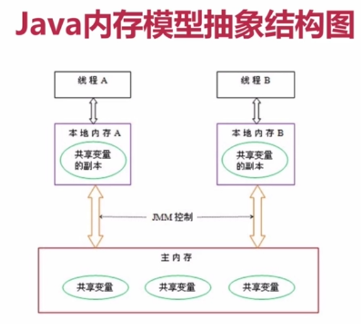
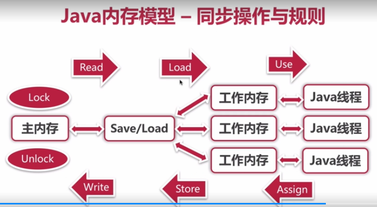

**Java并发编程艺术知识点**

来源于《Java并发编程的艺术》华科大佬博客Java并发指南：https://blog.csdn.net/column/details/21961.html

## Java并发编程的基本概念 ##：

1.首先应该弄清楚几个名词：并发，多线程，线程安全。理解Java实现多线程的方法，线程相关知识点《第一章》《第四章》。

2.JMM内存模型《第三章》

3.关键字：synchronize，volatile，final关键字。

4.并发编程三要素：

- 原子性：一个或者多个操作要么**全部执行成功，要么全部执行失败**。
- 有序性：程序执行的顺序按照**代码的顺序**(处理器可能对指令进行重排序)。
- 可见性：多个线程在访问同一个变量时，如果其中一个线程对其作了修改，**其他线程能立即获取到最新的值**。

5.线程的五大状态

- 创建状态：当用new创建一个线程的时候。
- 就绪状态：调用start方法，处于就绪状态的线程不一定马上就会执行run方法，还需要等待cpu的调度。
- 运行状态：CPU开始调度线程。并执行run方法
- 阻塞状态:线程的执行过程由于一些原因进入阻塞状态，比如：调用sleep方法，尝试得到一个锁等。
- 死亡状态：run方法执行完或者执行过程中遇到一个异常。

  
 

6.活跃性问题

- 死锁：哲学家就餐
- 饥饿：就餐挤不进去，一直得不到资源。
- 活锁：相互礼让，又总是主动放弃资源。

7.线程安全性

当多个线程访问某个类时，不管运行时环境采用**何种调度方式**或者这些进程将如何交替执行，并且在主调代码中**不需要任何额外的同步或协同**，这个类都能表现出**正确的行为**，那么这个类是线程安全的。

**原子性**：提供了互斥访问，同一时刻只能有一个线程来对它进行操作。

**原子性--对比**

synchronized：不可中断锁，适合竞争不激烈，可读性好。

Lock:可中断锁(unlock)，多样化同步，竞争激烈时能维持常态。

Atomic：竞争激烈时维持常态，比Lock性能好，只能同步一个值

**可见性**：一个线程对主内存的修改可以及时的被其他线程观察到。

导致共享变量在线程间不可见的原因：线程交叉执行，重排序结合线程交叉执行，共享变量更新后的值没有在工作内存与主内存及时更新。

**有序性**：一个线程观察其他线程中的指令执行顺序，由于指令重排序的存在，该观察结果一般杂乱无序。

## 6.线程的创建方式 ##

- 1.继承Thread类

Daemon线程使程序退出执行，d1.interrupt();//仅仅调用interrupt不能实现线程终止，可以配合interrupted()中断标志使用。

   package video.threadCreate;

    public class Demo1 extends Thread{
    @Override
    public void run() {
        while (!interrupted()) {//中断标志
            System.out.println(getName() + "线程执行");
        }
    }
    public static void main(String[] args){
        Demo1 d1 = new Demo1();
        Demo1 d2 = new Demo1();
        //
     //        d1.setDaemon(true);//守护线程或者叫支持性线程，
    //        d2.setDaemon(true);

        d1.start();
        d2.start();

        d1.interrupt();//仅仅调用interrupt不能实现线程终止
        //d1.stop();//无限期终止
    //        try {
    //            Thread.sleep(2000);
    //        } catch (InterruptedException e) {
    //            e.printStackTrace();
    //        }
    }
    }
- 2.实现Runable接口

//runable只是作为线程任务传给Thread。

    public class Demo implements Runnable {
    @Override
    public void run() {
        while(true){
            System.out.println("线程执行");
        }
    }
    public static void main(String[] args){
        Thread thread = new Thread(new Demo());
        thread.start();
    }
    }

- 3.使用匿名内部类

 public class Demo2 {

    public static void main(String[] args){
             //使用子类
    //        new Thread(){
    //            @Override
    //            public void run() {
     //                System.out.println("线程执行");
    //            }
    //        }.start();
           //使用Runable对象
        new Thread(new Runnable() {
            @Override
            public void run() {
                System.out.println("线程执行");
            }
        }).start();
    }
    }
- 4.使用Callable接口，有返回值。

public class Demo3 implements Callable<Integer> {

    public static void main(String[] args)throws Exception {
        Demo3 d = new Demo3();
        FutureTask<Integer> task = new FutureTask<>(d);
        Thread t = new Thread(task);
        t.start();
        System.out.println("先做点其他事情");
        Integer res = task.get();
        System.out.println(res);
    }
    //类似于run方法
    @Override
    public Integer call() throws Exception{
        System.out.println("正在进行计算");
        Thread.sleep(3000);
        return 1;
    }
    }

- 5.定时器(quartz框架)

public class Demo4 {

    public static void main(String[] args){
        Timer timer = new Timer();
        timer.schedule(new TimerTask() {
            @Override
            public void run() {
                System.out.println("timetask is run");
            }
        },0,1000);
    }
    }

- 6.线程池：装有多个线程的容器，降低线程的创建和销毁的时间。

  public class Demo5 {

    public static void main(String[] args){
        //创建带有10个线程的线程池
        //Executor threadPool = Executors.newFixedThreadPool(10);
        ExecutorService threadPool =  Executors.newCachedThreadPool();//认为够用就回收，不够用就创建线程
        //线程任务
        for(int i=0;i<100;i++) {
            threadPool.execute(new Runnable() {
                @Override
                public void run() {
                    System.out.println(Thread.currentThread().getName());
                }
            });
        }
    }
    }
- lambda表达式。

# Java内存模型 《第三章》#

## 1.Volatile ##
轻量级synchronized，保证共享变量的可见性，与synchronized相比执行成本低，不会引起上下文切换和调度。

可见性和原子性。

## 第四章：Java并发编程基础 ##

    package com.zl.Concurrency.demo4;
    
    import java.lang.management.ManagementFactory;
    import java.lang.management.ThreadInfo;
    import java.lang.management.ThreadMXBean;
    
    public class MultiThread {
    public static void main(String[] args){
        
        //获取Java线程管理MXBean
        ThreadMXBean threadMXBean = ManagementFactory.getThreadMXBean();
        //不需要获取同步的monitor和synchronizer信息，仅获取线程和线程堆栈信息
        ThreadInfo[] threadInfos = threadMXBean.dumpAllThreads(false,false);
        //遍历线程信息，仅打印线程ID和线程名称信息
        for(ThreadInfo threadInfo : threadInfos){
            System.out.println("[" + threadInfo.getThreadId() + "]" + threadInfo.getThreadName());
        }
        
    }
    }

    output:
    [11]Monitor Ctrl-Break
    [10]Common-Cleaner
    [5]Attach Listener
    [4]Signal Dispatcher
    [3]Finalizer
    [2]Reference Handler
    [1]main
    

从上面可以看出，一个Java程序不仅仅是main()方法的运行，而是main线程和多个其他线程的同时运行。

    package com.zl.Concurrency.demo4;
    
    import java.util.ArrayList;
    import java.util.List;
    import java.util.concurrent.TimeUnit;
    
    public class Priority {
    private static volatile boolean notStart = true;
    private static volatile boolean notEnd = true;

    public static void main(String[] args)throws Exception{
        List<Job> jobs = new ArrayList<Job>();
        for(int i=0;i<10;i++){
            int pripority = i < 5 ? Thread.MIN_PRIORITY:Thread.MAX_PRIORITY;
            Job job = new Job(pripority);
            jobs.add(job);
            Thread thread = new Thread(job,"Thread:" + i);
            thread.setPriority(pripority);
            thread.start();
        }
        notStart = false;
        TimeUnit.SECONDS.sleep(10);
        notEnd = false;
        for(Job job : jobs){
            System.out.println("Job Priority : " + job.priority + ",Count :"+job.jobCount);
        }

    }
    static class Job implements Runnable{
        private int priority;
        private long jobCount;
        public Job(int priority){
            this.priority = priority;
        }

        @Override
        public void run() {
            while(notStart){
                Thread.yield();
            }
            while (notEnd){
                Thread.yield();
                jobCount++;
            }
        }
    }
    }

    Job Priority : 1,Count :7446508
    Job Priority : 1,Count :5103665
    Job Priority : 1,Count :15529731
    Job Priority : 1,Count :12993933
    Job Priority : 1,Count :7446411
    Job Priority : 10,Count :17143169·
    Job Priority : 10,Count :25792168
    Job Priority : 10,Count :16736302
    Job Priority : 10,Count :16935396
    Job Priority : 10,Count :18582495

书上输出的结构差距不大，但是我的机器输出结果有明显差异。**线程优先级不能作为程序正确性的依赖？？**

**线程状态**
线程创建之后，调用start()方法开始运行。当线程执行wait()方法之后，线程进入等待状态。进入等待状态的线程需要依靠其他线程的通知才能返回到运行状态。而超时等待状态相当于在等待状态上加上超时限制，也就是超时时间到达时将会返回运行状态。当线程调用同步方法时，在没有获取锁的情况下，线程将会进入阻塞状态。线程在执行Runnable的run方法之后将会进入终止状态。

Daemon线程
    package com.zl.Concurrency.demo4;
    
    public class Daemon {
    public static void main(String[] args){
        Thread thread = new Thread(new DaemonRunner(),"DaemonRunner");
        thread.setDaemon(true);
        thread.start();
    }

    static class DaemonRunner implements Runnable{
        @Override
        public void run() {
            try{
                SleepUtils.second(10);
            }finally {
                System.out.println("DaemonThread finally run.");
            }
        }
    }

    }

Daemon线程被用作完成支持性工作，但是Java虚拟机在退出时Daemon线程中的finally块不一定会执行。

## ThreadLocal ##

ThreadLocal,即线程变量，是一个以ThreadLocal对象为键，任意对象为值的存储结构。这个结构被附带在线程上，也就是说一个线程可以根据一个ThreadLocal对象查询到绑定在这个线程的的一个值。

**源码：**

get方法：获取ThreadLocalMap中Entry中的value值，ThreadLocalMap是Thread类中的对象，是ThreadLocal中的静态内部类;。

    public T get() {
        Thread t = Thread.currentThread();
        ThreadLocalMap map = getMap(t);
        if (map != null) {
            ThreadLocalMap.Entry e = map.getEntry(this);
            if (e != null) {
                @SuppressWarnings("unchecked")
                T result = (T)e.value;
                return result;
            }
        }
        return setInitialValue();
    }

set方法

    public void set(T value) {
        Thread t = Thread.currentThread();
        ThreadLocalMap map = getMap(t);
        if (map != null)
            map.set(this, value);
        else
            createMap(t, value);
    }
remove方法

## 深入理解Java内存模型 ##

在并发编程中，需要处理两个关键问题：线程之间的**通信**以及线程之间的**同步**。通信是指线程之间以何种机制来交换信息。在命令式编程中，线程之间通信机制有两种：**共享内存**和**消息传递**。

在共享内存的并发模型里。线程之间共享程序的公共状态，线程之间通过写-读内存中的公共状态来进行隐式通信。在消息传递的并发模型里，线程之间没有公共状态，线程之间通过明确的发送显式进行通信。

  
 

## 同步8种操作和规则 ##

  
 

lock：锁定，作用于**主内存**的变量，把变量标识为一条独占状态。

unlock：解锁，作用于**主内存**的变量，把一个锁定状态变量释放出来，释放后的变量才可以被其他线程锁定。

Read：读取，作用于**主内存**变量，把一个变量值从主内存中传输到线程的工作内存中，以便随后的load动作使用。

Load：载入，作用于**工作内存**的变量，将read操作从主内存得到的变量值放入到工作内存的变量副本中。

Use：使用，作用于**工作内存**的变量，把工作内存中的一个变量值传递给执行引擎。

Assign：赋值，作用于**工作内存**的变量，把一个从执行引擎收到的值赋给工作内存的变量。

Store:存储，作用于**工作内存**的变量，把工作内存中的一个变量的值传送到主内存中吗，以便随后的write的操作。

Wirte:写入，作用于**主内存**的变量，它把store操作从工作内存中的一个变量的值传送到主内存的变量中。

## 1.重排序 ##
编译器和处理器为了提高程序性能而对指令序列进行重新排序的一种手段。

1. 数据依赖性：编译器和处理器在重排序时，不会改变存在数据依赖关系的两个操作的执行顺序。

2. as-if-serial语义：不管怎么重排序，都不能改变程序执行结果。

3. 程序顺序规则：happens-before规则。

## 2.happens-before ##

用来指定两个操作之间的执行顺序，提供跨线程的内存可见性。当一个操作的执行结果对另一个操作可见，那么这两个操作之间必然存在happens-before关系。

**happens-before规则：**

- 1.程序顺序规则：一个线程中的每个操作，happens-before于该线程中的任意后续操作。按程序顺序执行。只能保证单线程安全，不能保证多线程。
- 2.监视器锁规则：（上一个线程的锁解锁，下一个锁的获取）对一个锁的解锁，happens-before于随后对这个锁加锁。
- 3.volatile变量规则：对于一个volatile域的写，happens-before于任意后续对这个volatile域的读。
- 4.传递性：A --->B B--->C  A---->C
- 5.线程启动Start规则:如果A线程执行操作ThreadB.start()(启动线程B)，那么A线程的ThreadB.start()操作happens-before于线程B中的任意操作。
- 6.线程中断规则：对线程interrupt()方法的调用先行发生于被中断的线程代码检测到中断的发生。
- 7.线程终结规则Join规则：线程中所有的操作都先行发生于线程的终止检测，可以通过Thread.join方法结束、Thread.isAlive()的返回值手段检测到线程已经终止执行，如果线程A执行操作ThreadB.join()并成功返回，那么线程B中任意操作happens-before于线程A从ThreadB.join()操作成功返回。
- 8.对象终结规则：一个对象的初始化完成先行发生于它的finalize()方法的开始。

## 3.锁的内存语义 ##

- 锁的释放和获取建立happens-before关系：1.程序顺序规则，2.监视器规则，3.传递性规则。
- 锁的释放和获取的内存语义：1.线程A释放一个锁，其实质上是想接下来要获取的锁的某个线程传递消息(线程A对共享变量所做的修改)；2.线程B获取一个锁，其实质上是线程B接收了之前某个线程的消息(对共享变量所做的修改)。3.线程A释放锁，随后线程B获取这个锁。这个过程实质上是线程A通过线程B发送消息。

## 4.volatile内存语义 ##
volatile的写-读类似于锁的释放和获取。

volatile写和读建立的happens-before关系：1.程序顺序规则，2.volatile规则，3.传递性规则。
volatile写和读的内存语义：当写一个volatile变量时，JMM会把该线程对应的本地内存中共享变量值刷新到主内存。当读一个volatile变量时，JMM会把该线程对应的本地内存置为无效，而该线程接下来从主内存中读取共享变量。

总结：1.线程A写一个volatile变量时，实质上是线程A向接下来要读这个volatile变量的某个线程发出了消息(其对共享变量所做的修改)。2.当线程B读一个volatile变量时，实质上是线程B接收了某个线程发出的消息(在写操作时，volatile变量对主内存中变量的修改)。3.线程A写一个volatile变量，随后线程B读这个volatile变量，这个过程实质上是线程A通过主内存向线程B发送消息。

## 5.final的内存语义 ##
**final域的重排序规则**：1.构造方法内对一个final域的写入，与随后把这个被构造对象的引用赋值给一个引用变量，这两个操作之间不能重排序。2，初次读取一个包含final域的对象引用，与随后初次读这个final域，这两个操作之间不能重排序。

**写final域的重排序规则：**写final域的重排序规则禁止把final域的写重排序到构造函数之外。这个规则的实现包含两个方面：1.JMM禁止编译器把final域的写重排序到构造函数之外，2.编译器会在final域的写之后，构造函数return之前，插入一个StoreStore屏障。这个屏障禁止处理器把final域写重排序到构造函数之外。

**读final域的重排序规则：**在一个线程中，初次读对象引用与初次读对象包含final域，JMM禁止重排序这两个操作，编译器会在读final域操作的前面插入一个LoadLoad屏障。

## synchronized ：依赖JVM##

作用：

- 放在普通方法上，作用于调用这个方法的对象，内置锁作用域该实例对象，所谓的互斥锁即为独占锁。
- 修饰静态方法时，内置锁作用域是当前Class字节码对象，作用于类的所有对象。
- 修饰类：括号括起来的部分，作用于类所有对象。
- 修饰**代码块**时，内置锁作用Synchronized作用域括号里配置的对象。

synchronized用的锁是存在java对象头里的，如果对象时数组类型，虚拟机用三个字宽(4字节)存储对象头，如果是非数组类型，则用两个字宽存储对象头。

JMM关于synchronized的两条规定：1.线程解锁前，必须把共享变量的最新值刷新到主内存 2.线程加锁时，将清空工作内存中的共享变量的值，从而使用共享变量时需要从主内存中重新读取最新的值。

**对象头中的信息**：

Mark Word：存储对象的hashcode或锁信息。
Class Metadata Address:存储对象类型数据的指针。
Array length：数组的长度。

在JVM中的原理：

进入代码块时，会有一个monitorenter指令，退出代码块时，会有一个monitorexit指令。

**偏向锁**

作用：由于每次获取锁和释放锁都会浪费资源，且实际情况是大多数情况下总是由一个线程获取，为了降低获得锁的代价引入偏向锁。

- 线程ID：线程第一次访问同步代码块时，会在对象头和栈帧中的锁记录锁偏向的**线程ID**，后续该线程访问时只需要测试对象头的MarkWord中是否存在该线程的偏向锁，如果测试成功则，表示线程已经获得锁，如果测试失败，检测Mark Word中的偏向**锁标识**是否设置为1，如果没有则使用CAS竞争锁，如果设置了，则尝试使用CAS将对象头的偏向锁指向当前线程。

偏向锁的撤销：偏向锁使用一种等到竞争出现才释放锁的机制，当其他线程尝试竞争偏向锁时，才考虑释放锁。偏向锁撤销时，暂停拥有偏向锁的线程，然后检查所有偏向锁的线程是否活着，如果不处于活跃状态，则将对象头设置为无锁状态，如果线程仍然活着，拥有偏向锁的栈会被执行。

关闭偏向锁：-XX：-UseBiasedLocking=flase，程序默认进入轻量级锁。

**轻量级锁**

轻量级锁加锁：执行同步代码块前，JVM会在当前线程的栈帧中创建用于锁记录的空间，并将对象头中Mark Word替换为指向锁记录的指针，如果成功，当前线程获得锁，如果失败，表示其他线程竞争锁，当前线程便尝试使用**自旋**来获取锁。

轻量级锁解锁：使用原子CAS操作将锁记录中的Mark Word(Displaced Mark Word)替换到对象头,如果成功，则表示没有竞争发生。如果失败，表示当前锁存在竞争，锁会膨胀为重量级锁(自旋失败转化为重量级锁)。

重量级锁：

自旋锁：（自旋就是cpu在空转）。

**Java中的锁**

1. 重入锁：synchronized(隐式的支持重进入)。
2. 自旋锁：

## volatile ##

轻量级锁，被volatile修饰的变量是可见的。所谓可见性就是当一个线程修改一个共享变量时，另一个线程能读到修改这个值。synchronize除了互斥也可以保证可见性

通过加入**内存屏障**和**禁止重排序**优化来实现

对volatile变量进行写操作时，会在**写操作**后加入一条**store屏障指令**，将本地内存中共享变量值刷新到主内存。

对volatile变量读操作时，会在**读操作**前加入一条**load屏障指令**，从主内存中读取共享变量。

volatile底层实现，

# Lock接口 #

Lock接口需要显示地获取和释放锁，繁琐是代码灵活；实际上对synchronized进行简单的包装。

特点：
1. 非阻塞获取锁。
2. 能被中断的获取锁。
3. 超时获取锁。

## AbstractQueuedSynchronizer(AQS)详解 ##

- tryAcquire(int) ：独占模式获取对象状态。
- tryRelease(int) ：独占模式下释放线程调用。
- tryAcquireShared(int) ：共享模式下获取对象。
- tryReleaseShared(int) ：共享模式释放线程调用。
- isHeldExclusively() ：如果同步是以独占方式进行的，则返回true；其他情况则返回 false 。

## ReentrantLock ##

# 线程之间的通信 #

notify方法会随机叫醒一个处于wait状态的线程，notifyAll叫醒所有处于wait线程，争夺到时间片的线程只有一个。当调用wait方法时，会释放锁，当调用notify方法时会拿到锁。

## 生产者消费者模式 ##

**高并发与并发的区别**

并发：多个线程操作相同的资源，保证线程安全，合理使用资源，主要着眼于线程。

高并发：服务能同时处理很多请求，提高程序性能。

## CPU多级缓存 ##

主内存-->一级缓存--二级缓存

缓存的的作用：由于CPU的速度太快，主存跟不上，为了缓解CPU和内存之间速度不匹配问题，需要加入缓存。

缓存的意义：时间局部性，空间局部性。 

多级缓存的缓存一致性（MESI）

M:modfiy修改。E：独占，S：shared：分享。I：无效的 4种状态

乱序执行优化：处理器为提高运算速度而做出违背代码原有顺序的优化。

## JAVA中的13个原子类 ##

Atomic包中总共有13个类，分为四种类型的原子更新方式，分别是原子更新基本数据类型、原子更新基本数组、原子更新基本引用和原子更新属性。

## 1.原子的方式更新基本数据类型 ##

主要包含三个类：AtomiBoolean，AtomicInteger,AtomicLong。

常用方法：

- int addAndGet(int delta):以原子的方式将输入的数值与实例中的值相加，并返回结果。
- boolean compareAndSet(int expect,int update):如果输入的数值等于预期值，则以原子的方式将该值设置为输入的值。
- int getAndIncrement():以原子的方式将当前值加1，这里返回的是自增前的值。
- void lazySet(int newValue):最终会设置成newValue，使用lazySet设置值后，可能会导致其他线程在之后的一小段时间内还是可以读到旧的值。
- int getAndSet(int newValue):以原子方式设置为newValue的值，并返回旧值。

package demo7;

import java.util.concurrent.atomic.AtomicInteger;

/**
 * @author zlCalma
 * @date 2018/11/28 21:37.
 */

    public class AtomicIntegerTest {
    static AtomicInteger ai = new AtomicInteger(1);

    public static void main(String[] args) {
        System.out.println(ai.getAndIncrement());//1
        System.out.println(ai.get());//2
        System.out.println(ai.addAndGet(3));//5
        System.out.println(ai.compareAndSet(5,6));//true
        //System.out.println(ai.lazySet(7));
        ai.lazySet(7);
        System.out.println(ai.get());//7
        System.out.println(ai.getAndSet(8));//
        System.out.println(ai.get());//8
    }

    }

**getAndIncrement()是如何保证原子性的？**

通过分析源码可以发现在getAndIncrement()中调用compareAndSet()方法，只有当前值未被其他线程修改，也就是说等于期望的值时，才可以更新。

**Atomic中只提供三种基本类型的原子更新，其他数据类型如何进行原子更新呢？**

Atomic包中基本都是使用Unsafe实现的，而Unsaft中只提供三种CAS方法：compareAndSwapObject,compareAndSwapInt,compareAndSwapLong。分析AtomicBoolean的源码可以发现，它是先将Boolean转化为整形，再使用compareAndSwapInt进行原子CAS，所以其他数据类型也可以用类似的思路来实现。

## 原子更新数组 ##

通过原子的方式更新数组中的某个元素，Atomic包提供了4个类。

- AtomicIntegerArray:原子更新的整形数组中的元素。
- AtomicLongArray：原子更新长整型数组中的元素。
- AtomicReferenceArray:原子更新引用数据类型里的元素。

常用方法：

int addAndGet(int i,int delta)以原子的方式将输入值与数组中索引为i的元素相加。
boolean compareAndSet(int i,int expect,int update):如果当前值等于预期值，则以原子方式将数组位置i的元素设置成update值。

package demo7;

import java.util.concurrent.atomic.AtomicInteger;
import java.util.concurrent.atomic.AtomicIntegerArray;

/**
 * @author zlCalma
 * @date 2018/11/28 22:44.
 */
    public class AtomicIntegerArrayTest {

    static int[] value = new int[]{1,2};

    static AtomicIntegerArray ai = new AtomicIntegerArray(value);

    public static void main(String[] args) {
        ai.getAndSet(0,3);
        System.out.println(ai.get(0));//3
        System.out.println(value[0]);//1
    }
    }

数组value通过构造函数传递进去，然后AtomicIntegerArray会将当前数组复制一份，然后当AtomicIntegerArray对内部数组元素进行修改时，不会影响传入的数组。

## 原子更新引用类型 ##

主要包含三个类：
AtomicReference:原子引用更新
AtomicReferenceFieldUpdater:原子更新引用类型的字段
AtomicMarkableReference:原子更新带有标记位的引用类型，可以原子更新一个布尔类型的标记位和引用类型。构造方法是AtomicMarkableReference(V initialRef,boolean initialMark)。

    package demo7;
    
    import java.util.concurrent.atomic.AtomicReference;

/**
 * @author zlCalma
 * @date 2018/11/28 22:55.
 */

    public class AtomicReferenceTest {

    public static AtomicReference<User> atomicReference = new AtomicReference<User>();

    public static void main(String[] args) {
        User user  = new User("conan",15);
        atomicReference.set(user);
        User updateUser = new User("shinichi",17);
        atomicReference.compareAndSet(user,updateUser);
        System.out.println(atomicReference.get().getName());
        System.out.println(atomicReference.get().getOld());
    }

    static class User{
        private String name;
        private int old;

        public User(String name, int old) {
            this.name = name;
            this.old = old;
        }

        public String getName() {
            return name;
        }

        public void setName(String name) {
            this.name = name;
        }

        public int getOld() {
            return old;
        }

        public void setOld(int old) {
            this.old = old;
        }
    }
    }
## 原子更新字段类 ##

当需要更新某个类中的某个字段时，就需要使用原子更新字段类，Atomic包提供已下三个类进行原子字段更新

AtomicIntegerFieldUpdate：原子更新整形的字段的更新器
AtomicLongFieldUpdate：原子更新长整型字段的更新器
AtomicStampedUpdate：“原子更新带有版本号的引用类型。该类将整数值与引用关联起来。可用于原子的更新数据和数据的版本号，可以解决使用CAS进行原子操作更新可能处出现的ABA问题。

package demo7;

import java.util.concurrent.atomic.AtomicIntegerFieldUpdater;

/**
 * @author zlCalma
 * @date 2018/11/28 23:08.
 */
    public class AtomicIntegerFieldUpdaterTest {

    //创建原子更新器，并设置要更新的对象类和类的属性
    private static AtomicIntegerFieldUpdater<User> atomicIntegerFieldUpdater =
            AtomicIntegerFieldUpdater.newUpdater(User.class,"old");

    public static void main(String[] args) {
        User conan = new User("conan",10);
        System.out.println(atomicIntegerFieldUpdater.getAndIncrement(conan));//10
        System.out.println(atomicIntegerFieldUpdater.get(conan));//11
    }
    public static class User{
        private String name;
        public volatile int old;

        public User(String name, int old) {
            this.name = name;
            this.old = old;
        }

        public String getName() {
            return name;
        }

        public void setName(String name) {
            this.name = name;
        }

        public int getOld() {
            return old;
        }

        public void setOld(int old) {
            this.old = old;
        }
    }
    }

根据上述代码可知，原子的更新字段类需要两步，首先，原子更新字段类都是抽象类，每次更新时必须使用静态方法newUpdater创建一个更新器，并且需要设置想要更新的类和类的字段，然后更新字段必须使用public volatile修饰。
